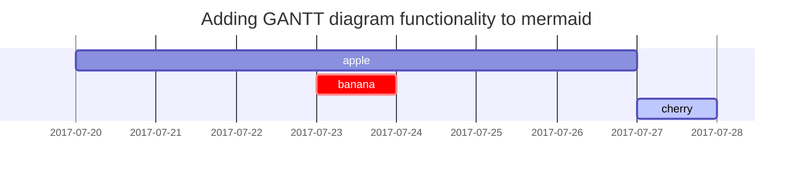

# Writing a new post

---
title: Writing a New Post
author: cotes
date: 2019-08-08 14:10:00 +0800
categories: [Blogging, Tutorial]
tags: [writing]
render_with_liquid: false
---

This tutorial will guide you how to write a post in the _Chirpy_ template, and it's worth reading even if you've used Jekyll before, as many features require specific variables to be set.

To use live reload start with `bundle exec jekyll s --force-polling`

## Naming and Path

Create a new file named `YYYY-MM-DD-TITLE.EXTENSION`{: .filepath} and put it in the `_posts`{: .filepath} of the root directory. Please note that the `EXTENSION`{: .filepath} must be one of `md`{: .filepath} and `markdown`{: .filepath}. If you want to save time of creating files, please consider using the plugin [`Jekyll-Compose`](https://github.com/jekyll/jekyll-compose) to accomplish this.

## Front Matter

Basically, you need to fill the [Front Matter](https://jekyllrb.com/docs/front-matter/) as below at the top of the post:

```yaml
---
title: TITLE
date: YYYY-MM-DD HH:MM:SS +/-TTTT
categories: [TOP_CATEGORIE, SUB_CATEGORIE]
tags: [TAG]     # TAG names should always be lowercase
---
```

> The posts' _layout_ has been set to `post` by default, so there is no need to add the variable _layout_ in the Front Matter block.
{: .prompt-tip }

### Timezone of Date

In order to accurately record the release date of a post, you should not only set up the `timezone` of `_config.yml`{: .filepath} but also provide the post's timezone in variable `date` of its Front Matter block. Format: `+/-TTTT`, e.g. `+0800`.

### Categories and Tags

The `categories` of each post are designed to contain up to two elements, and the number of elements in `tags` can be zero to infinity. For instance:

```yaml
---
categories: [Animal, Insect]
tags: [bee]
---
```

### Author Information

The author information of the post usually does not need to be filled in the _Front Matter_ , they will be obtained from variables `social.name` and the first entry of `social.links` of the configuration file by default. But you can also override it as follows:

Adding author information in `_data/authors.yml` (If your website doesn't have this file, don't hesitate to create one).

```yaml
<author_id>:
  name: <full name>
  twitter: <twitter_of_author>
  url: <homepage_of_author>
```
{: file="_data/authors.yml" }


And then use `author` to specify a single entry or `authors` to specify multiple entries:

```yaml
---
author: <author_id>                     # for single entry
# or
authors: [<author1_id>, <author2_id>]   # for multiple entries
---
```


Having said that, the key `author` can also identify multiple entries.

> The benefit of reading the author information from the file `_data/authors.yml`{: .filepath } is that the page will have the meta tag `twitter:creator`, which enriches the [Twitter Cards](https://developer.twitter.com/en/docs/twitter-for-websites/cards/guides/getting-started#card-and-content-attribution) and is good for SEO.
{: .prompt-info }

## Table of Contents

By default, the **T**able **o**f **C**ontents (TOC) is displayed on the right panel of the post. If you want to turn it off globally, go to `_config.yml`{: .filepath} and set the value of variable `toc` to `false`. If you want to turn off TOC for a specific post, add the following to the post's [Front Matter](https://jekyllrb.com/docs/front-matter/):

```yaml
---
toc: false
---
```

## Comments

The global switch of comments is defined by variable `comments.active` in the file `_config.yml`{: .filepath}. After selecting a comment system for this variable, comments will be turned on for all posts.

If you want to close the comment for a specific post, add the following to the **Front Matter** of the post:

```yaml
---
comments: false
---
```

## Mathematics

For website performance reasons, the mathematical feature won't be loaded by default. But it can be enabled by:

```yaml
---
math: true
---
```

## Mermaid

[**Mermaid**](https://github.com/mermaid-js/mermaid) is a great diagrams generation tool. To enable it on your post, add the following to the YAML block:

```yaml
---
mermaid: true
---
```

Then you can use it like other markdown languages: surround the graph code with ```` ```mermaid ```` and ```` ``` ````.

### Download files

```Markdown
... you can [download the PDF](/assets/diagram.pdf) here.
```

## Images

### Caption

Add italics to the next line of an image，then it will become the caption and appear at the bottom of the image:

```markdown

_Image Caption_
```
{: .nolineno}

### Size

In order to prevent the page content layout from shifting when the image is loaded, we should set the width and height for each image.

```markdown
{: width="700" height="400" }
```
{: .nolineno}

> For an SVG, you have to at least specify its _width_, otherwise it won't be rendered.
{: .prompt-info }

Starting from _Chirpy v5.0.0_, `height` and `width` support abbreviations (`height` → `h`, `width` → `w`). The following example has the same effect as the above:

```markdown
{: w="700" h="400" }
```
{: .nolineno}

### Position

By default, the image is centered, but you can specify the position by using one of the classes `normal`, `left`, and `right`.

> Once the position is specified, the image caption should not be added.
{: .prompt-warning }

- **Normal position**

  Image will be left aligned in below sample:

  ```markdown
  {: .normal }
  ```
  {: .nolineno}

- **Float to the left**

  ```markdown
  {: .left }
  ```
  {: .nolineno}

- **Float to the right**

  ```markdown
  {: .right }
  ```
  {: .nolineno}

### Dark/Light mode

You can make images follow theme preferences in dark/light mode. This requires you to prepare two images, one for dark mode and one for light mode, and then assign them a specific class (`dark` or `light`):

```markdown
{: .light }
{: .dark }
```

### Shadow

The screenshots of the program window can be considered to show the shadow effect:

```markdown
{: .shadow }
```
{: .nolineno}

### CDN URL

If you host the images on the CDN, you can save the time of repeatedly writing the CDN URL by assigning the variable `img_cdn` of `_config.yml`{: .filepath} file:

```yaml
img_cdn: https://cdn.com
```
{: file='_config.yml' .nolineno}

Once `img_cdn` is assigned, the CDN URL will be added to the path of all images (images of site avatar and posts) starting with `/`.

For instance, when using images:

```markdown

```
{: .nolineno}

The parsing result will automatically add the CDN prefix `https://cdn.com` before the image path:

```html

```
{: .nolineno }

### Image Path

When a post contains many images, it will be a time-consuming task to repeatedly define the path of the images. To solve this, we can define this path in the YAML block of the post:

```yml
---
img_path: /img/path/
---
```

And then, the image source of Markdown can write the file name directly:

```md

```
{: .nolineno }

The output will be:

```html

```
{: .nolineno }


### Preview Image

If you want to add an image at the top of the post, please provide an image with a resolution of `1200 x 630`. Please note that if the image aspect ratio does not meet `1.91 : 1`, the image will be scaled and cropped.

Knowing these prerequisites, you can start setting the image's attribute:

```yaml
---
image:
  path: /path/to/image
  alt: image alternative text
---
```

Note that the [`img_path`](#image-path) can also be passed to the preview image, that is, when it has been set, the  attribute `path` only needs the image file name.

For simple use, you can also just use `image` to define the path.

```yml
---
image: /path/to/image
---
```

### LQIP

For preview images:

```yaml
---
image:
  lqip: /path/to/lqip-file # or base64 URI
---
```

> You can observe LQIP in the preview image of post [_Text and Typography_](/posts/text-and-typography/).


For normal images:

```markdown
{: lqip="/path/to/lqip-file" }
```
{: .nolineno }

## Pinned Posts

You can pin one or more posts to the top of the home page, and the fixed posts are sorted in reverse order according to their release date. Enable by:

```yaml
---
pin: true
---
```

## Prompts

There are several types of prompts: `tip`, `info`, `warning`, and `danger`. They can be generated by adding the class `prompt-{type}` to the blockquote. For example, define a prompt of type `info` as follows:

```md
> Example line for prompt.
{: .prompt-info }
```
{: .nolineno }

## Syntax

### Inline Code

```md
`inline code part`
```
{: .nolineno }

### Filepath Hightlight

```md
`/path/to/a/file.extend`{: .filepath}
```
{: .nolineno }

### Code Block

Markdown symbols ```` ``` ```` can easily create a code block as follows:

````md
```
This is a plaintext code snippet.
```
````

#### Specifying Language

Using ```` ```{language} ```` you will get a code block with syntax highlight:

````markdown
```yaml
key: value
```
````

> The Jekyll tag `` is not compatible with this theme.
{: .prompt-danger }

#### Line Number

By default, all languages except `plaintext`, `console`, and `terminal` will display line numbers. When you want to hide the line number of a code block, add the class `nolineno` to it:

````markdown
```shell
echo 'No more line numbers!'
```
{: .nolineno }
````

#### Specifying the Filename

You may have noticed that the code language will be displayed at the top of the code block. If you want to replace it with the file name, you can add the attribute `file` to achieve this:

````markdown
```shell
# content
```
{: file="path/to/file" }
````

#### Liquid Codes

If you want to display the **Liquid** snippet, surround the liquid code with `` and ``:

````markdown

```liquid

  This product's title contains the word Pack.

```

````

Or adding `render_with_liquid: false` (Requires Jekyll 4.0 or higher) to the post's YAML block.

## Videos

You can embed a video with the following syntax:

```liquid

```
Where `Platform` is the lowercase of the platform name, and `ID` is the video ID.

The following table shows how to get the two parameters we need in a given video URL, and you can also know the currently supported video platforms.

| Video URL                                                                                          | Platform  | ID            |
|----------------------------------------------------------------------------------------------------|-----------|:--------------|
| [https://www.**youtube**.com/watch?v=**H-B46URT4mg**](https://www.youtube.com/watch?v=H-B46URT4mg) | `youtube` | `H-B46URT4mg` |
| [https://www.**twitch**.tv/videos/**1634779211**](https://www.twitch.tv/videos/1634779211)         | `twitch`  | `1634779211`  |


## Learn More

For more knowledge about Jekyll posts, visit the [Jekyll Docs: Posts](https://jekyllrb.com/docs/posts/).

%%%%%%%%%%%%%%%%%%%%%%%%%%%%%%%%%
%%%%%%%%%%%%%%%%%%%%%%%%%%%%%%%%%
%%%%%%%%%%%%%%%%%%%%%%%%%%%%%%%%%

# Typograpthy

---
title: Text and Typography
author: cotes
date: 2019-08-08 11:33:00 +0800
categories: [Blogging, Demo]
tags: [typography]
pin: true
math: true
mermaid: true
image:
  path: /commons/devices-mockup.png
  lqip: data:image/webp;base64,UklGRpoAAABXRUJQVlA4WAoAAAAQAAAADwAABwAAQUxQSDIAAAARL0AmbZurmr57yyIiqE8oiG0bejIYEQTgqiDA9vqnsUSI6H+oAERp2HZ65qP/VIAWAFZQOCBCAAAA8AEAnQEqEAAIAAVAfCWkAALp8sF8rgRgAP7o9FDvMCkMde9PK7euH5M1m6VWoDXf2FkP3BqV0ZYbO6NA/VFIAAAA
  alt: Responsive rendering of Chirpy theme on multiple devices.
---

This post is to show Markdown syntax rendering on [**Chirpy**](https://github.com/cotes2020/jekyll-theme-chirpy/fork), you can also use it as an example of writing. Now, let's start looking at text and typography.

## Headings

<h1 class="mt-5">H1 - heading</h1>

<h2 data-toc-skip>H2 - heading</h2>

<h3 data-toc-skip>H3 - heading</h3>

<h4>H4 - heading</h4>

## Paragraph

Quisque egestas convallis ipsum, ut sollicitudin risus tincidunt a. Maecenas interdum malesuada egestas. Duis consectetur porta risus, sit amet vulputate urna facilisis ac. Phasellus semper dui non purus ultrices sodales. Aliquam ante lorem, ornare a feugiat ac, finibus nec mauris. Vivamus ut tristique nisi. Sed vel leo vulputate, efficitur risus non, posuere mi. Nullam tincidunt bibendum rutrum. Proin commodo ornare sapien. Vivamus interdum diam sed sapien blandit, sit amet aliquam risus mattis. Nullam arcu turpis, mollis quis laoreet at, placerat id nibh. Suspendisse venenatis eros eros.

## Lists

### Ordered list

1. Firstly
2. Secondly
3. Thirdly

### Unordered list

- Chapter
  + Section
    * Paragraph

### ToDo list

- [ ] Job
  + [x] Step 1
  + [x] Step 2
  + [ ] Step 3

### Description list

Sun
: the star around which the earth orbits

Moon
: the natural satellite of the earth, visible by reflected light from the sun

## Block Quote

> This line shows the _block quote_.

## Prompts

> An example showing the `tip` type prompt.
{: .prompt-tip }

> An example showing the `info` type prompt.
{: .prompt-info }

> An example showing the `warning` type prompt.
{: .prompt-warning }

> An example showing the `danger` type prompt.
{: .prompt-danger }

## Tables

| Company                      | Contact          | Country |
|:-----------------------------|:-----------------|--------:|
| Alfreds Futterkiste          | Maria Anders     | Germany |
| Island Trading               | Helen Bennett    | UK      |
| Magazzini Alimentari Riuniti | Giovanni Rovelli | Italy   |

## Links

<http://127.0.0.1:4000>

## Footnote

Click the hook will locate the footnote[^footnote], and here is another footnote[^fn-nth-2].

## Inline code

This is an example of `Inline Code`.

## Filepath

Here is the `/path/to/the/file.extend`{: .filepath}.

## Code blocks

### Common

```
This is a common code snippet, without syntax highlight and line number.
```

### Specific Language

```bash
if [ $? -ne 0 ]; then
  echo "The command was not successful.";
  #do the needful / exit
fi;
```

### Specific filename

```sass
@import
  "colors/light-typography",
  "colors/dark-typography";
```
{: file='_sass/jekyll-theme-chirpy.scss'}

## Mathematics

The mathematics powered by [**MathJax**](https://www.mathjax.org/):

$$ \sum_{n=1}^\infty 1/n^2 = \frac{\pi^2}{6} $$

When $a \ne 0$, there are two solutions to $ax^2 + bx + c = 0$ and they are

$$ x = {-b \pm \sqrt{b^2-4ac} \over 2a} $$

## Mermaid SVG



## Images

### Default (with caption)

{: width="972" height="589" }
_Full screen width and center alignment_

### Left aligned

{: width="972" height="589" .w-75 .normal}

### Float to left

{: width="972" height="589" .w-50 .left}
Praesent maximus aliquam sapien. Sed vel neque in dolor pulvinar auctor. Maecenas pharetra, sem sit amet interdum posuere, tellus lacus eleifend magna, ac lobortis felis ipsum id sapien. Proin ornare rutrum metus, ac convallis diam volutpat sit amet. Phasellus volutpat, elit sit amet tincidunt mollis, felis mi scelerisque mauris, ut facilisis leo magna accumsan sapien. In rutrum vehicula nisl eget tempor. Nullam maximus ullamcorper libero non maximus. Integer ultricies velit id convallis varius. Praesent eu nisl eu urna finibus ultrices id nec ex. Mauris ac mattis quam. Fusce aliquam est nec sapien bibendum, vitae malesuada ligula condimentum.

### Float to right

{: width="972" height="589" .w-50 .right}
Praesent maximus aliquam sapien. Sed vel neque in dolor pulvinar auctor. Maecenas pharetra, sem sit amet interdum posuere, tellus lacus eleifend magna, ac lobortis felis ipsum id sapien. Proin ornare rutrum metus, ac convallis diam volutpat sit amet. Phasellus volutpat, elit sit amet tincidunt mollis, felis mi scelerisque mauris, ut facilisis leo magna accumsan sapien. In rutrum vehicula nisl eget tempor. Nullam maximus ullamcorper libero non maximus. Integer ultricies velit id convallis varius. Praesent eu nisl eu urna finibus ultrices id nec ex. Mauris ac mattis quam. Fusce aliquam est nec sapien bibendum, vitae malesuada ligula condimentum.

### Dark/Light mode & Shadow

The image below will toggle dark/light mode based on theme preference, notice it has shadows.

{: .light .w-75 .shadow .rounded-10 w='1212' h='668' }
{: .dark .w-75 .shadow .rounded-10 w='1212' h='668' }

## Video



## Reverse Footnote

[^footnote]: The footnote source
[^fn-nth-2]: The 2nd footnote source


